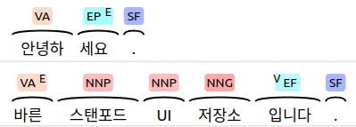

# bareun-tag-renderer

## 바른 스탠포드 UI

<p align="center">
  
</p>

- 바른은 스탠포드 유저 인터페이스를 적용하였습니다.
- 한국어의 경우, 하나의 음절과 어절 안에 여러 형태소 정보가 포함됩니다.
- 스탠포드 UI 스타일을 통해 생략과 축약 형태소, 형태소의 종류 등의 주석을 이해하기 쉽게 시각화할 수 있습니다.
- 이러한 UI를 개발에 사용할 수 있게 소스를 공개하오니 많은 이용부탁드립니다.

## 사전 준비사항

### Yarn 설치하기

- 이 프로젝트는 Yarn 패키지 관리자를 사용합니다. 아래의 링크로 들어가서 Yarn을 설치해주세요.
- [Yarn](https://classic.yarnpkg.com/en/docs/install#debian-stable)

## 프로젝트 실행 방법

### 1. 필요한 패키지 설치하기

- 프로젝트 디렉토리에서 아래의 명령어를 실행하여 필요한 패키지를 설치합니다.

```
yarn install
```

### 2. 개발 모드로 실행하기

- 개발 모드에서 프로젝트를 실행하려면 아래의 명령어를 입력하세요.

```
yarn run dev
```

<p align="center">
  
</p>

- 명령어를 실행하면 위 그림과 같이 개발 페이지가 열립니다.
- 형태소 분석 후 반환된 JSON Format을 붙여넣기하면 이미지가 생성됩니다.

### 3. 프로젝트 빌드 방법

- 프로젝트를 빌드하려면 아래의 명령어를 실행합니다.
- 명령어를 실행하면 dist 폴더가 생성되고 개발에 필요한 css 파일과 js 파일이 생성됩니다.

```
yarn run build
```
